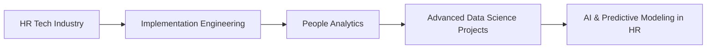

<!-- Profile Header -->
<!-- https://github-readme-stats.vercel.app/api?username=irenebetsy -->
<h1 align="center">👋 Hey there, This is Irene Betsy D</h1>
<h3 align="center">🚀 Data Enthusiast | ⚙️ Implementation Engineer | 📊 Data Science Graduate</h3>

<!-- Moving Text -->

  

---

# 📝 Overview
👩🏻‍🎓 **M.Sc in Data Science** | ⚙️ **Implementation Engineer @ HFactor (A Ciel Group)** | 💻 **Ex-Data Engineer @ Adrenalin eSystems**  
💡 Passionate about transforming **complex datasets** into **actionable insights** and building solutions that create impact.

---

# 💼 Impact Areas
<table>
<tr>
  <td>
    <ul>
      <li>📊 <strong>Data Engineering</strong> — Collect, store, and prepare data for analysis, Attrition Prediction</li>
      <li>🤖 <strong>Machine Learning & Analytics</strong> — Predictive Models, EDA, Deep Learning solutions</li>
      <li>🧠 <strong>AI Specializations</strong> — Computer Vision (CV), NLP, and advanced DL architectures</li>
      <li>⚙️ <strong>Implementation Engineering</strong> — Client-specific integrations, solution deployments, performance tuning, payroll module implementations</li>
      <li>🌐 <strong>Bridging Tech & HR</strong> — People Analytics, HR dashboards, AI transforming HR</li>
    </ul>
  </td>
  <td>
    
  </td>
</tr>
</table>

---

# 💡 Inventions

📦 **outlier-toolkit** — A custom Python library for outlier detection & handling (Z-score, IQR, Winsorization, Replace, Remove, Binning).

---

# 🛠 Tech Stack & Tools
<!-- Badges with Links -->

## Programming & Frameworks

## Machine Learning & Deep Learning

## NLP & Computer Vision

## Data & Analytics

## Tools & Platforms

---

# 📈 GitHub Analytics

  
  

  

  

---

# 🏆 GitHub Achievements

  

---

## ⏳ Weekly Development Breakdown

  <!------>
  
  

---

# 📌 Career Focus

---

# 💡 My Tech Inspiration
<table>
<tr>
  <td>
    <blockquote>
      “The most damaging phrase in the language is: ‘It’s always been done that way.’” 
      — <em>Grace Hopper</em> 👩‍💻
    </blockquote>
    
💖 Grace Hopper inspires me — not just for her groundbreaking contributions to computer science, but for her fearless approach to challenging norms and pushing technology forward. I strive to bring the same curiosity, courage, and creativity into every project I work on.

  </td>
  <td>
    
  </td>
</tr>
</table>

---

# 📬 Let's Connect!

---

# 🔭 More way to go

---

# ✨ Fun Touch

> “Curiosity, passion, and a little bit of code can change the world.” 🚀
